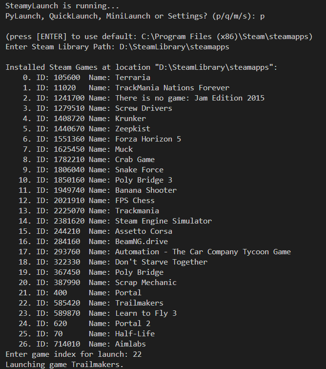

# SteamyLaunch

SteamyLaunch is a Python program designed to help you search for and launch your Steam games directly from the terminal. It offers a convenient way to access your game library without opening the Steam client. Additionally, SteamyLaunch can launch Steam's own mini-games list as an alternative.

## Features

- **Search and Launch Games**: Quickly find and start any game from your Steam library using terminal commands.
- **Mini-Games List**: Access and launch games from Steam's mini-games list directly through the program.

## Help

**Q:** *How do I find the `steamapps` directory in other library locations for SteamyLaunch?*

**A:** Open Steam. Then, find your storage settings at `Steam > Settings > Storage`. In the dropdown, select the library you are looking for. In the kebab menu (3 dots button) select browse folder and copy your directory from file explorer. You may want to change the default directory in the source code to this. The directory should end in `.../steamapps/`.

**Q:** *After using the in-built steam mini-games list, my steam never appears at full size! How do I bring it back?*

**A:** This function actually opens your steam library as usual, but with Steam in `Small Mode`. You can return Steam to its usual `Big Mode` size at `View > Big/Small Mode`.
